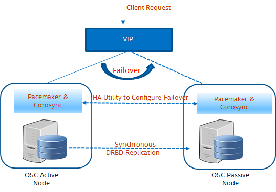
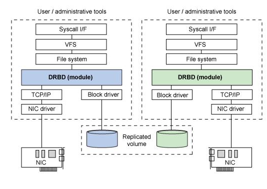

# OSC High Availability
- OSC High Availability eliminates from single points of failure which protects from unplanned downtime.
- Performs regular checks to make sure each OSC Service Node is working properly, and if one fails, switch it out for one that is working.
- It tries to bring back the failed services into the cluster and maintains the same number of services node.
    
#### There are 2 types of failures
1. Service Stops
	OSC service may be stopped abnormaly.
2. Node Stops
	OSC Service Node Stopped because of some reasons.

## Background
Currently, OSC does not have the HA configuration option to handle above failure types.So,A high availability OSC will work by having more service nodes than it needs,will perform regular checks to make sure each service/node is working properly, and if one fails, switching it out for one that is working.

We have explored two approaches.
1. Two nodes cluster with Active/Passive setup using Pacemaker,Corosync and Distributed Replicated Block Device(DRBD).
2. Segregate Application and Persistence Layers.

## OSC HA with Active/Passive Setup 
Two nodes cluster with Active/Passive setup using Pacemaker,Corosync and Distributed Replicated Block Device(DRBD).
Active Node serve the requests where as Passive Node is Standby.So,on fails of Active Node,Passive Node will get promoted to Active Node.
Pacemaker and Corosync maintains Service HA where It achieves maximum availability for your cluster services by detecting and recovering from node- and resource-level failures by making use of the messaging and membership capabilities provided by Corosync.
DRBD is a software-based, shared-nothing, replicated storage solution mirroring 
the content of block devices (hard disks, partitions, logical volumes etc.) between hosts.

#### Active/Passive Architecture Diagram

 

**Pacemaker and Corosync provide Service HA where as DRBD data replication through Synchronous updates.**

#### DRBD Architecture Diagram

 

**DRBD is the replacement of shared storage systems by networked mirroring.Also,called Network based RAID 1 mirroring for the data.It allows read writes on Active Node where as completely disallows to Passive Node.**

## OSC HA Through Segregating Application and Persistence Layers
Currently,OSC is tightly coupled the Application and Persistence Layers.So,creating HA for persistence layer is little hard.Seprating the Application and Persistence Layers will make the OSC loose couple.Also,creating the HA for both the layers will be easier and as per the other openstack services.

#### HA Architecture Diagram for Application and Persistence Layers

 

**Application and Persistence Layers seprated out with seprate HA.H2 Database has H2 Plugins for Active/Standby setup options and replications.**

### Deployment
OSC will be two nodes cluster and will be deployed on single controller node.Threre will be single instance running with extra standby for failover.Active Node always servers the request where as standby will be completely in dump state.

### Load balance/HA redundancy
HAProxy will do the Load Balancing as well traffic redirection to the Active Node.

# Concerns Using the above Proposed Designs
1.How to Avoid Running OSC Jobs when it is in Passive Mode?
The Passive Mode running OSC jobs may cause the problem . But we can avoid it through below strategy.
- There should be a Monitoring thread to check the status of the node.
- The Monitoring thread should be in the loop and in sleep state until it gets the Node status as Active.
- The Node status can get through “pcs status resources” command.
If it is passive , should not start the complete OSC such as RabbitMq , WebSocket , Scheduler, Opening the database connection etc. during Server Start.
- As soon as the OSC Node gets promoted to Active , it should start remaining services.

2.How pacemaker notifies the status to the registered node?
- Pacemaker provides the brain that processes and reacts to events regarding the cluster. These events include nodes joining or leaving the cluster; resource events caused by failures, maintenance and scheduled activities; and other administrative actions. Pacemaker will compute the ideal state of the cluster and plot a path to achieve it after any of these events. This may include moving resources, stopping nodes and even forcing them offline with remote power switches.
- It notifies all the cluster nodes.
- Through configurations,the state changes get notified.

3.Is it possible to hook on the pacemaker to bring up docker container based on pacemaker passive-to-active notification?
- Yet to check.

4.We need to be generic in HA solution. we should not use any service which is only openstack specific.
5.Is it possible to have shared volume between all the instances and keep all OSC related stuff in that volume?
- iSCSI provides it.But need to check in details for HA.

# Future Investigations
- How does DRBD works in multi node deployment?
- How to customize data replication?
- How to configure in Heat Template?
- Need to analyze for the code changes required to segregate Application and Database
- Is there any better solutions?

